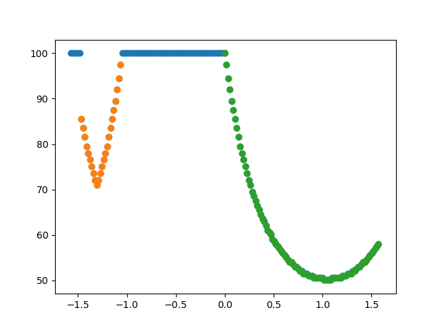
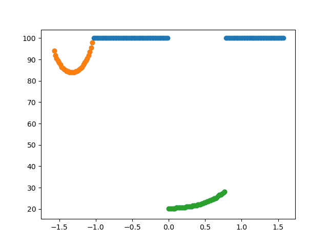
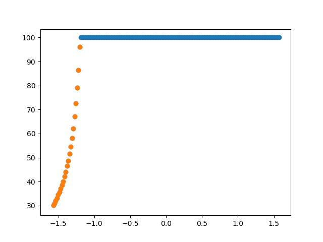
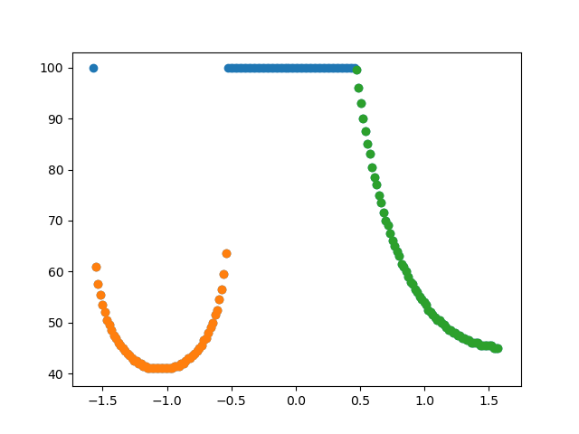

# 2D Lidar Scanner Simuluation
This is a simple 2D LIDAR scanner simulation

## Requirements
```
pip install numpy
pip install matplotlib
```
## Description
* The environment is defined in ```env.py```.
* The lidar scanner parameters if defined in ```lidar_scanner.py```.
* The obstalce clustering is computed in ```obstacle_clustering.py```


## Lidar visualization and Obstacle clustering
<p float="left">
  
   
</p>
<p float="left">
  
   
</p>
<p float="left">
  
   
</p>
<p float="left">
  
   
</p>