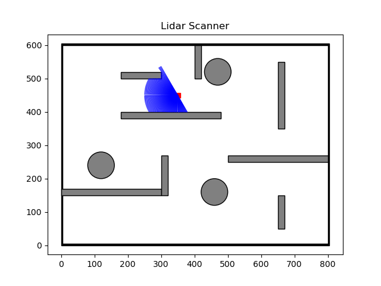

# 2D Lidar Scanner Simuluation
This is a simple 2D LIDAR scanner simulation

## Requirements
```
python3
numpy
matplotlib
```
## Description
The environment is defined in ```env.py```.<br>
The lidar scanner parameters if defined in ```lidar_scanner.py```.

## Results



